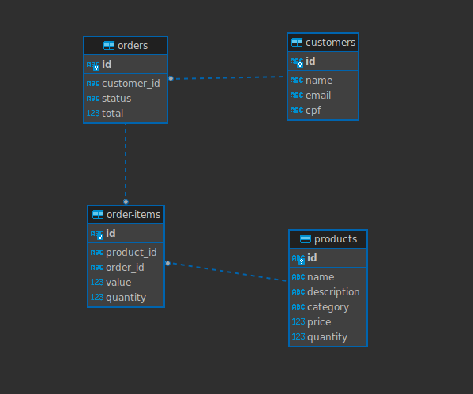

<h1 align="center">Orderly API</h1>

<p align="center">
  <a href="#-project">Project</a>&nbsp;&nbsp;&nbsp;|&nbsp;&nbsp;&nbsp;
  <a href="#-technologies">Tecnologies</a>&nbsp;&nbsp;&nbsp;|&nbsp;&nbsp;&nbsp;
  <a href="#-running">Running</a>&nbsp;&nbsp;&nbsp;|&nbsp;&nbsp;&nbsp;
  <a href="#-license">License</a>
</p>

<p align="center">
  <a href="#-license">
    
  </a>
</p>

## 💻 Project

Orderly API is a cutting-edge web API designed to streamline operations for restaurant and food businesses (RMS). It draws from the principles of **Domain-Driven Design (DDD)** and **Hexagonal Architecture** to ensure scalability, maintainability, and a robust integration capability.

## ✨ Technologies

This project was built using the following technologies and architectural concepts:

- [NestJS](https://nestjs.com/)
- [TypeScript](https://www.typescriptlang.org/)
- [Docker](https://www.docker.com/)
- [DDD (Domain-driven Design)](https://domainlanguage.com/)
- [Hexagonal Architecture](<https://en.wikipedia.org/wiki/Hexagonal_architecture_(software)>)

## 🟢 Running

Prerequisites: Ensure you have `docker`, `node>=18.16.0` & `npm>=9.5.1` installed.

1. Clone this project:

```sh
git clone https://github.com/tribofustack/orderly.git
```

2. Configure your environment by creating a `.env` file based on the `.env.example`.

3. Start the application:

```sh
npm run start:docker
```

4. Alternatively, start the application with the docker command:

```sh
docker compose up
```

This will launch the application at port `3000`.

Once it's up, the Swagger documentation can be accessed at `http://localhost:3000/`.

## Database ER Diagram

<div align="center">
  
</div>

## DDD (Domain-Driven Design)

Domain-Driven Design (DDD) is an approach to developing software for complex needs by deeply connecting the implementation to an evolving model of the core business concepts. Here's a breakdown of how DDD principles have been applied in Orderly:

### Domain Storytelling

#### 1.1. Entities

1. **Client**: Identified optionally by a Brazilian CPF.
2. **Payment**: Represents a transaction that will be used with OHS. Has an associated status (perhaps initiated, processed, confirmed).
3. **Order**: Represents a customer's request. It has associated status (Received, Preparing, Ready, Finalized).
4. **Service**: Represents the production of food. It has associated products and a client.
5. **Notification**: A medium for communication with the user and the restaurant. Will utilize an ACL for integration.
6. **Admin**: Handles promotional strategies and stock management.
7. **Stock**: Represents the available inventory of products.
8. **Product**: Items like Hamburger, Fries, Soda, etc.

#### 1.2. Value Objects

1. **ProductDetails**: For `Product`, attributes like `Name`, `Description`, `NutritionalInfo`, etc., can be value objects. They don't have an identity on their own, but they describe a Product.
2. **PaymentDetails**: For `Payment`, attributes like `Amount`, `Currency`, `QRCode` can be value objects.
3. **NotificationContent**: For `Notification`, details like `Message`, `Timestamp`, and `Type` could be value objects.

#### 1.3. Aggregates

1. **Check-in**: Rooted at `Client`, with `Order` being part of the aggregate.
2. **Check-out**: Rooted at `Order`, which affects both `Deliver` and `Production`.
3. **Communication**: Rooted at the `Notification` system, interfacing via an ACL.
4. **Billing**: Rooted at `Payment`, using ACL to conform with OHS.
5. **Admin**: Rooted at `Admin`, influencing the `Stock`.

#### 1.4. Domain Events

1. **ClientRegistered**: Triggered when a client registers.
2. **ProductsSelected**: Triggered when products are selected.
3. **OrderCreated**: Triggered after order creation.
4. **PaymentProcessed**: Triggered during the payment process.
5. **PaymentApproved**: Triggered upon payment confirmation.
6. **StatusUpdatedToReceived**: Triggered when order status changes.
7. **ClientNotified**: Triggered to notify the client.

### Event Storming

<div align="center">
  
</div>

### Context Map

<div align="center">
  
</div>

## 📝 License

This project is licensed under the MIT License. For more information, please refer to the [LICENSE](LICENSE.md) file.
